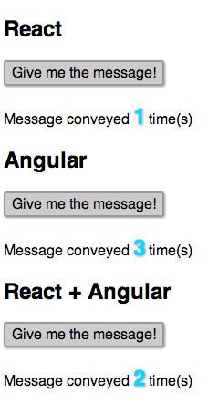
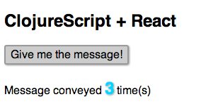

# Angular With React

This project shows how to convert the same plain JavaScript function into an Angular controller/directive and a React component.
Angular and React are 2 of the leading frameworks that offer solid support for reusing and composing UI components.
We are also showing how to render a React component from an Angular controller.

 

## Angular Controller/Directive and React component from the same POJO

The code is based on the simple component in this Tuts+ tutorial:
[Intro to the React Framework](http://net.tutsplus.com/tutorials/javascript-ajax/intro-to-the-react-framework/)

We want to **separate the presentation/interaction logic from the rendering**. This function does not depend on React, Angular or
any framework, it only makes very reasonable assumptions about what traits will be mixed in:

    var PlainSimple = function () {
        return {
            getInitialState: function () {
                return { count: 0 };
            },

            handleMouseDown: function () {
                alert('I was told: ' + this.props.message);
                this.setState({ count: this.state.count + 1});
            }
        }
    }

Then it can be converted into a React component:

    // converting the plain JavaScript object with presentation/interaction logic into a React component
    var Simple = React.createClass($.extend(PlainSimple(), {

      render: function(){

        return 

          

            Give me the message!
          

          
Message conveyed
            {this.state.count} time(s)

        

        ;
      }
    }));

    React.renderComponent(<Simple message="Keep it Simple"/>,
                      document.getElementById('react'));

or into an Angular controller/directive:

    myapp.controller('IndexCtrl', function ($scope, $injector) {
        // settings, could be read from config
        var settings = {props: {message: 'Keep It Simple'}};
        // mixing in the React component logic into the controller
        $injector.invoke(ReactCtrl(PlainSimple(), settings), this, {$scope: $scope});
    });

For reference, here is the Angular template:

        
Give me the message!

        
Message conveyed {{this.state.count}}
            time(s)
        

## Using React for views and Angular for routing and the rest

The React syntax is a big downside in my opinion, but it can be done:

    myapp.controller('IndexCtrl', function ($scope, $injector) {
        // converting the plain JavaScript object with presentation/interaction logic into a React component
        var Simple = React.createClass($.extend(PlainSimple(), {
            render: function () {
                return React.DOM.div({},
                        React.DOM.div({className: 'clicker', onMouseDown: this.handleMouseDown}, 'Give me the message!'),
                        React.DOM.div({className: 'message'},
                        'Message conveyed ', React.DOM.span({className: 'count'}, this.state.count), " time(s)")
                );
            }
        }));

        React.renderComponent(Simple({message: 'Keep It Simple'}), document.getElementById('both'));
    });

## ClojureScript offers a nicer syntax

I've used the [Cloact](http://holmsand.github.io/cloact/) project to create the same component:

    (def counter (atom 0))
    (defn simple []
      [:div
       [:div.clicker {:on-click #(swap! counter inc)} "Give me the message!"]
       [:div.message {} "Message conveyed " [:span.count @counter] " time(s)"]])

    (defn ^:export run []
      (cloact/render-component [simple]
                               (.-body js/document)))
